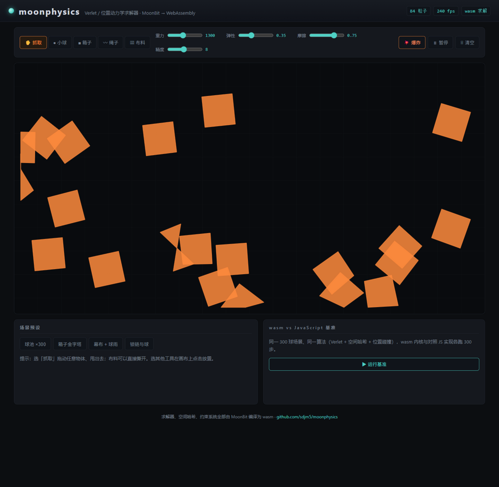

# moonphysics

A 2D **physics sandbox** whose solver — Verlet integration, distance
constraints, a uniform spatial hash, positional collision response — is
written in [MoonBit](https://www.moonbitlang.com/) and compiled to
WebAssembly. Balls, rigid boxes, hanging ropes and tearable cloth, all
grab-and-flingable at hundreds of particles per frame.



```text
per step (1/60 s), all inside the wasm module:

  Verlet integrate  →  k × (solve constraints → spatial hash → positional
                        collision separation)  →  wall bounce + friction
```

Pick a tool and click the canvas to drop balls, boxes, ropes or cloth; grab
anything with the pointer and fling it; hit 💥 to detonate the scene; rip the
cloth apart by dragging a node too hard. A benchmark panel races the wasm
solver against a hand-written JavaScript mirror of the *same algorithm* over
the *same initial state*.

## The engine

- **Position-based dynamics (Verlet)** — velocity lives implicitly in
  `p − p_prev`, so positional corrections become velocities for free:
  bounces emerge from pushing particles back inside bounds, and flinging a
  grabbed particle needs no velocity bookkeeping.
- **Rigid boxes** are particle clusters: four corners joined by four visible
  edge sticks and two hidden diagonal braces.
- **Tearable cloth** — every cloth link carries a stretch limit; pull past
  2.4× rest length and it rips (the UI lets you do this by hand).
- **Uniform spatial hash** rebuilt once per step keeps collision detection
  O(n): 300 particles cost ~0.4 ms per step in a 16.6 ms frame budget.
- **Zero allocation steady state** — all particles, constraints, hash
  buckets and scratch arrays are preallocated FixedArrays.

## The wasm boundary

The scene lives on the MoonBit (GC) side; the host drives it with
command-style exports (`spawn_*`, `grab`/`drag`/`release`, `explode`,
`step`) and reads a compact snapshot for rendering — one exported call and
one typed-array read per frame, no per-object boundary crossings.

Snapshots are **f64-exact**: particle records store position, radius and the
previous position verbatim, so `snapshot_out → snapshot_in` round trips
byte-identically. That property is pinned by a determinism test (same state +
same steps ⇒ identical snapshot bytes) and is what makes the benchmark fair —
both implementations start from the very same bits.

The renderer reads positions from a `Float64Array` view and the particle
kind from a `Uint32Array` view at byte 40 of each 48-byte record — mixing
the two views over one buffer, no copying.

## wasm vs JavaScript

Same algorithm, same initial state, warmed up, 200 steps each (your machine,
via the panel):

| particles | MoonBit wasm | JavaScript mirror | speedup |
| --- | --- | --- | --- |
| 300 | 0.384 ms/step | 0.380 ms/step | 0.99× |
| 1500 | 6.798 ms/step | 7.802 ms/step | 1.15× |

At toy scale V8's JIT matches wasm; as the working set grows the JIT's
advantage erodes while the wasm build stays flat — no deopt cliffs, no GC
pauses, no warm-up. The benchmark ships because the number was measured, not
assumed (the first debug-build run actually *lost* to JavaScript at 0.27×;
release builds flipped it, and the README keeps the honest curve).

## Layout

```
src/lib/        portable pure-MoonBit solver: Verlet integration, distance
                constraints with tearing, spatial hash, wall response,
                spawners (ball / rigid box / rope / cloth), pointer grab
src/kernel/     wasm foreign_library: 20 exports (commands + f64 snapshot)
web/            sandbox UI (canvas renderer, tools, sliders, scene presets),
                JS mirror solver + benchmark, kernel test suite,
                zero-dependency server
```

## Try it

```
moon build --target wasm --release
cp _build/wasm/release/build/src/kernel/kernel.wasm web/physics.wasm
node web/server.mjs 8095
# open http://127.0.0.1:8095
```

Scenes: **球池 ×300** (ball pit), **箱子金字塔** (box pyramid), **幕布 + 球雨**
(cloth curtain under ball rain), **锁链与球** (chains and balls). Tools:
抓取 grab-and-fling, 小球/箱子/绳子/布料 spawn at a click. Sliders tune
gravity, restitution, friction and solver iterations live.

## Tests

- **Solver**: `moon test` — 11 unit tests. Closed-form checks where the math
  is exact (free fall matches `y₀ + g·dt²·n(n+1)/2` after n steps, explosion
  impulse at a measured falloff), bounded stability checks where behavior is
  emergent (a three-box stack stays rigid, inside bounds, and put after 600
  steps; a rope hangs from its pin; cloth tears only when overstretched).
- **Kernel**: `node web/test-kernel.mjs` — 10 end-to-end checks over the
  wasm boundary: spawn accounting, 240-step settle sanity, grab/drag/fling,
  snapshot round trip, **byte-exact determinism across restore**, explosion
  impulse, and the real-time frame-budget check.

## Requirements

- MoonBit CLI (developed on 0.1.20260920) — `moon build --target wasm --release`
- Node.js 18+ for the dev server and kernel tests
- Any modern browser with WebAssembly for the sandbox

## License

[Apache-2.0](LICENSE)
